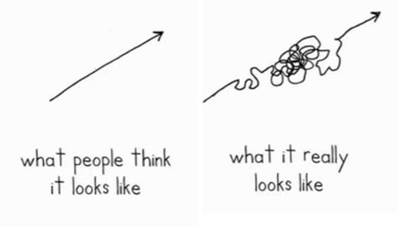

There is a certain comfort in linearity.

Often, I take comfort in knowing that as long as I write code a certain way, then my program will work and there will not be any bugs in it. Having a certain goal in mind, as well as knowing the specific path to get there, allows me to concentrate on tasks more easily and work more efficiently. However, as we all know from experience, no matter how hard we try to avoid failure, it always manages to find us. There will be bugs in our programs even though we coded everything "correctly." Problems that we thought had straightforward solutions were actually impossible.
