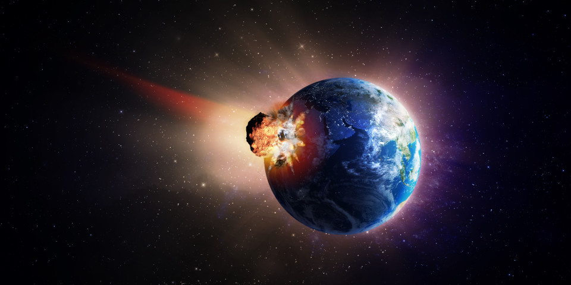

Meteors are supposed to be cool and interesting to watch. But they can quickly become disasters if they are too large. The Meteor application architecture is similar. It was supposed to be a modern web development platform that brings together many different frameworks and technologies to deliver a dynamic experience to users. However, it was overly ambitious. By trying to be the one-stop shop for dynamic web development, it became cluttered with all sorts of frameworks and technologies. User experience for developers rapidly deteriorates an application becomes more complex than a "Hello World" program.
