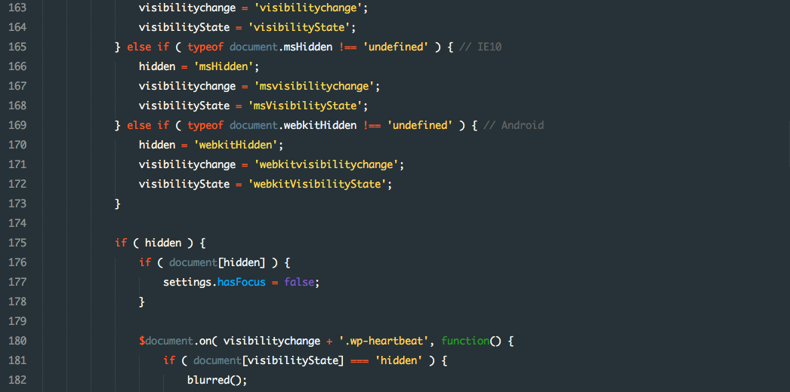

I have an obsession with spaces and semicolons in code. I agonize over whether I should leave a space after an "if" keyword. I am adamant about not putting opening curly braces on a new line and "lining them up" because I think that it just does not look good and is not worth the space of a new line.

Because of my background in other languages, I often mistakenly put a semicolon after a line when coding in Python, only to realize that it delimits lines by spacing instead of semicolons. At first I was angry with Python for not adhering to established coding standards that have been used for decades. But then I realized that maybe the standard was wrong. Maybe it <strong>is</strong> better to delimit statements based on spaces and newlines, which we already do (or should do) in other languages, and make the semicolon obsolete.

By default, Python (and practically all other languages) implements its own coding standard. Each line in a block of code must be indented the same way. However, this is not just to make the code look prettier. Because of the lack of curly braces, the interpreter cannot understand your code if it does not implement this standard.

Despite being obsessed with every little detail in my code, I do not think that you should force your coding standard onto others, who might have different preferences for how their code should look. As long as the style does not interfere with the correctness of the program, it should not matter very much whether you put spaces around operators.
