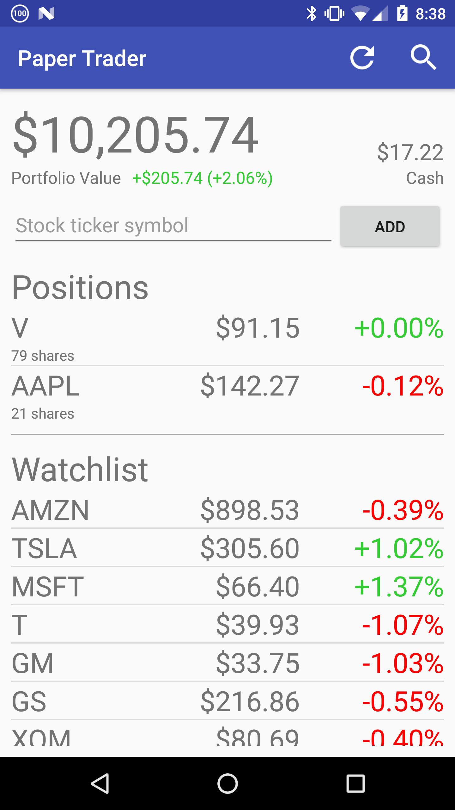
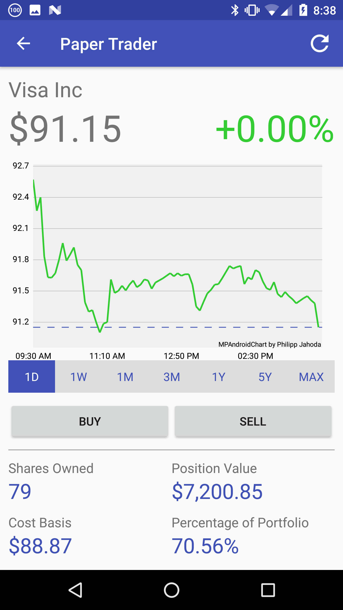
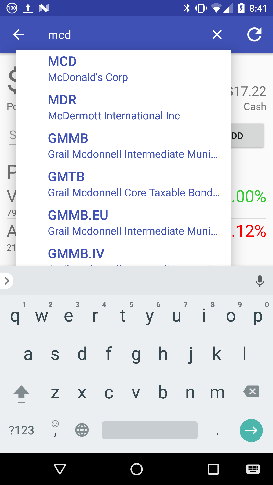

  
  
  

Paper Trader, as its name implies, is a paper trading app available on the Google Play Store for Android devices. It allows you to buy and sell U.S. stocks with virtual money. It gives you $10,000 to start with, but you can increase that amount by watching short videos. You can search for stocks by their ticker symbols or the names of the companies themselves. Once you have found a stock, you can view additional information about it, such as its current price, historical charts and performance, exchange it is traded on, market cap, and dividend yield. You can then buy or sell the stock and track your position and portfolio performance.

This was an individual project, so I was the only developer. I used Android Studio to create the app using the knowledge I learned from creating the Star Wars Soundboard. It was difficult to find a free financial API that works well. Most of the good financial APIs cost thousands of dollars per month. Therefore I settled for Google Finance and Markit On Demand, which are free but have significant delays in stock prices and loading times.

From this project I furthered my understanding of Android app development and learned that it is difficult to make a truly world-class app without significant financial resources and time. It is also extremely useful to name and describe your app relevantly, as Paper Trader is now near the top of Play Store search results for queries like "paper trader" and "paper trading". It has around 300 downloads, with around 100 active installs.

You can download <a href="https://play.google.com/store/apps/details?id=kesira.papertrader">Paper Trader</a> at the Google Play Store.

Source: <a href="https://github.com/tee0402/PaperTrader"><i class="large github icon "></i>tee0402/PaperTrader</a>

