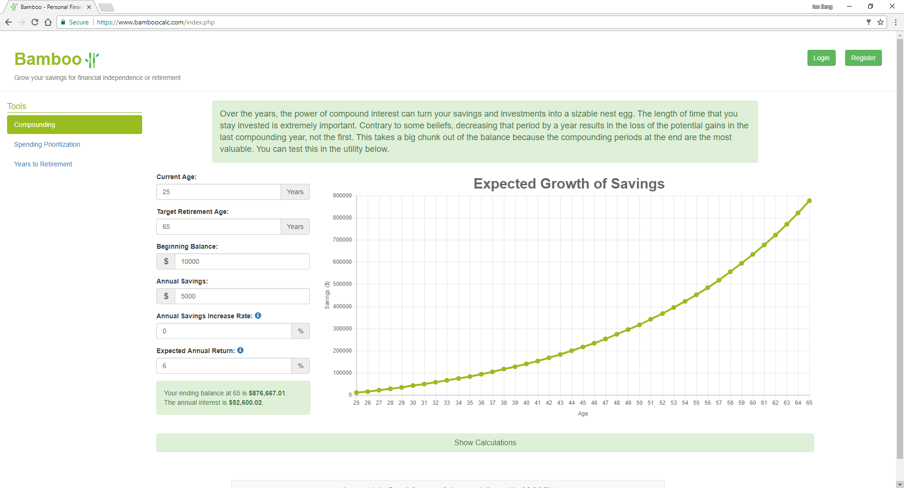

Bamboo is a web application that I first made to mimic and improve upon a financial spreadsheet that I had, but grew as I had more ideas to implement. The project allowed me to test my understanding of the web development technologies that I learned online. It has three personal finance tools. The first shows you the power of compounding if you keep putting money into your investments. The second gives you personalized spending recommendations for improving your financial situation. The third shows the relationship between your savings rate and years until retirement.

I used various web technologies, such as Bootstrap for the UI, AngularJS for the dynamic nature of the elements, and PHP and MySQL for user authentication and preferences. For hosting, I used a web host called 1&1. But to improve my knowledge of Linux and web hosting, I  also used the LAMP (Linux, Apache, MySQL, PHP) stack to host the website on my laptop.

In this project I gained experience with full-stack web development and associated technologies, including MySQL for database storage, the Bootstrap CSS Framework for the user interface, JavaScript and some of its frameworks for client-side programming, and PHP for server-side programming.
 
Website: <a href="https://www.bamboocalc.com">bamboocalc.com</a>

Source: <a href="https://github.com/tee0402/Bamboo"><i class="large github icon "></i>tee0402/Bamboo</a>
