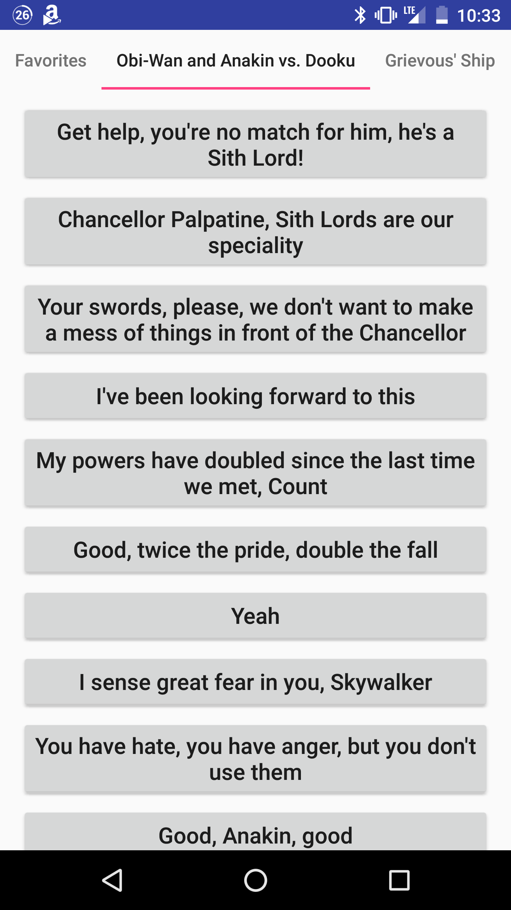

Star Wars Soundboard is an Android soundboard app with sound clips from the Star Wars Prequels. As anyone who have used a soundboard app would know, it consists of buttons that you press to play a small clip of interesting dialogue. You can add a clip to your favorites tab.

This project introduced me to Android app development concepts such as layouts, views and activities.

Unfortunately the Google Play Store suspended the app for copyright infringement.

Source: <a href="https://github.com/tee0402/StarWarsSoundboard"><i class="large github icon "></i>tee0402/StarWarsSoundboard</a>

