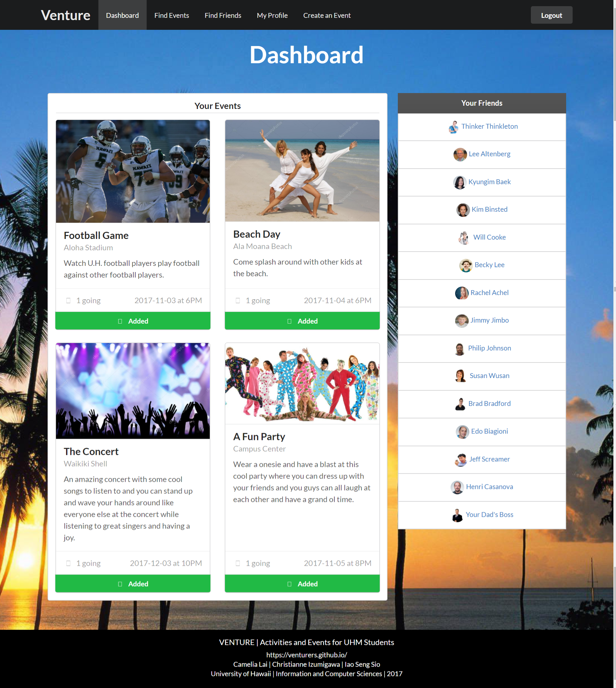

Star Wars Soundboard is an Android soundboard app with sound clips from the Star Wars prequels. As anyone who has used a soundboard app would know, it consists of buttons that you press to play a small clip of interesting sound or dialogue. You can long press a clip to add it to your favorites tab. This was a really fun project for me and my friends as we are Star Wars fans.

I worked on this project with a friend, who cut some sound clips for me. I used Android Studio to create this app. XML was used to create the layout, and Java was used along with the Android API to make the backend. A total of 223 sounds were cut from the movies using Audacity.

This project introduced me to Android app development concepts such as layouts, views and activities. I also learned some aspects of sound processing using Audacity.

Unfortunately the Google Play Store suspended the app for copyright infringement, so it is not on there. But the source code is on Github and I still have the apk, so it is still available for people who want it.

Website: <a href="http://ventureuhmanoa.meteorapp.com/">http://ventureuhmanoa.meteorapp.com/</a>

Source Code: <a href="https://github.com/venturers/venture"><i class="large github icon "></i>venturers/venture</a>

